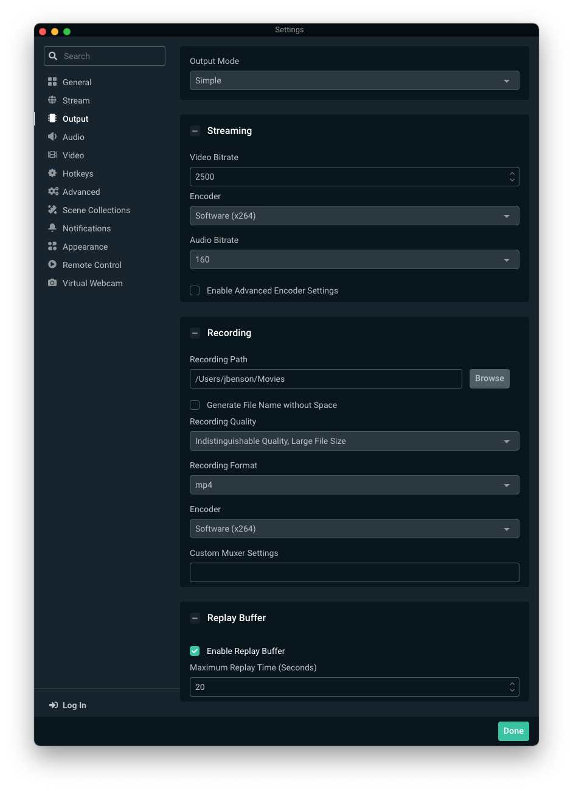
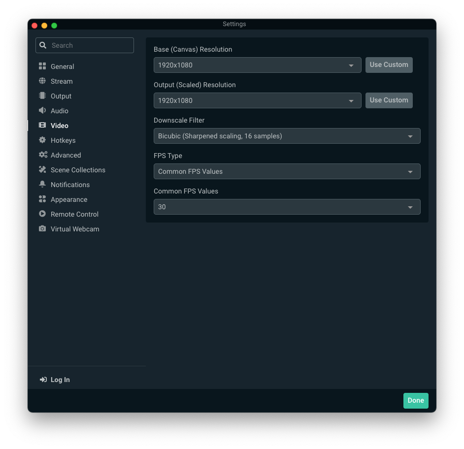
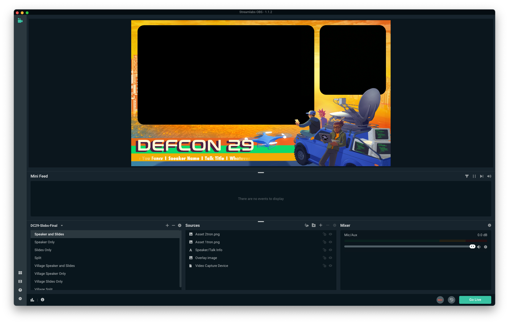

# DEFCON SLOBS Quickstart - MacOS

## Installation and Permissions

1. Download the template zip file from Basecamp to a known location (e.g. Downloads Folder); The zip file contains the template.overlay file and the heavy weight of Futura which is not part of MacOS by default.  
2. Unzip the zip file you downloaded
3. Install Futura Heavy by double clicking on Futura_Heavy_font.ttf and clicking "Install Font" once it opens in Font Book. 
3. Download & install Streamlabs OBS (SLOBS) for your platform: https://streamlabs.com/streamlabs-obs-live-streaming-software
4. If this is the first time running SLOBS you will have some setup to do:
      - Make sure to grant SLOBS permissions access camera and mic
      - You can skip the streaming service integrations
      - "Start Fresh"
      - You can tune the webcam/mic if you'd like, or revisit that later
      - Skip adding a theme (we will do this shortly).  

--- 
## Settings and Configuration
   
   *It's important that you apply the settings for output and video prior to importing the template set. If you've already added the template set and nothing fits on the canvas, delete the template set from SLOBS, apply these settings, then re-import the template set*.  
   
   Open the SLOBS application __Preferences/Settings__ to adjust some important settings:    
	  __Output__ ==> __Recording__: ensure the following selections:   
         - __Recording Quality__: *Indistingquishable Quality, Large File Size*.  
         - __Recording Format__: *mp4*.  
         - __Recording Path__: a path of your choice.  

 __Video__: from the left hand side of the preferences pane
            - Make sure both your __Base Canvas__ and __Output Resolution__ are set to `1920x1080`

---
## Import the DC29 Template Set

- Select the __Scene Collections__ preferences
- Select __Import Overlay File__
- Locate and select the __DC29-Slobs-Final.overlay__ file
- Click __Done__ to exit and save the changes
Verify you have new _Scenes_ in the __Scenes__ pane in the bottom left, select the appropriate scene for the video you will be recording. If successful, everything should look like this: 

---

## Customize for Your Talk

*If you do not see "Heavy" as a style option then you need to install that font variant which is distributed with the rest of the scene collection*    

You will need to edit the overlay text to describe your specific talk in **each** scene you will use
    
### Editing and Validating the Text & Font
   
- Double click the __Speaker/Talk Info__ in the __Sources__ pane 
- Check that the Font Family is set to __Futura__
- The Font Style should be set to __Heavy__
- The Font Size should be set to __288__

## Live Video Sources
You will need to add a video source (or two) to each of the scenes you plan to use. Your first video source will probably be of you speaking. Most presenters will probably be using a webcam or a phone, but there are many high resolution camera options available that work with OBS if you choose. Use something that shows you clearly. Lighting is more important than you think; you should be well-lit and use a background that contrasts your clothing so you appear clearly in the video.

Your second video source will likely be a screen recording or the screen of your computer for slides and or demos which you will record live. 

Regardless of which video source you choose, live or recorded, adding them will follow roughly the same instructions.
1. Select the scene you wish to use, from the bottom left pane (Scene Selection)
2. Under the sources pane, click the __+__ sign to add a source.
   - For capturing the screen, you would select __Display Capture__
   - For capturing a single window, you would select __Window Capture__ (this didn't always have expected results, testing is recommended)
   - For capturing a webcam, you would select __Video Capture Device__
3. Resize each video source to the correct size to fit within the template 
    - You may need to lock the template images/text to avoid accidentally moving or resizing the template
    - Be sure that the video source is under the template image and that any video sources that overlap are properly layered (edge of webcam is not on top of slides)
4. Check to ensure your video sources are listed at the bottom of the sources pane. This ensures they are "under" the template overlay and will inherit the visual effects intended
5. Resize and recenter your video after making sure it is under the template, it should appear to have rounded corners

## Test Recording

Once you have your video sources configured the way you want, they appear clearly in the preview window, and the audio level meter responds to your voice, you can try a test recording.

1. Click the __Start Recording__ option. 
    - You'll see a couple of visual cues, but in general, OBS/SLOBS does not have a lot of feedback during recording.
2. Record some test content. 
3. Click __Stop Recording.__

OBS places the recordings in the location you specified during the setup wizard, so you'll have to browse to that location and watch the video you just made. By default, they are named with the time and date you started recording. You'll want to peruse your test video to see how the audio sounds and how the video quality looks - if it all looks OK, you are good to record your full presentation.

## Audio Sources
High quality audio is imperative to having your video meet quality standards. Here are some suggestions for the best audio:
- Stand about 2-3 inches from the mic to avoid distorting your voice
- Avoid background noise like air conditioning (no AC on is preferred)
- Avoid filming outside or in noisy areas
- Test that your sound does not have echo. If it does, try a smaller room or more insulated space (closets work well)
- Your average recording volume should be between -12dB and -10dB; Check your levels on OBS by looking at the audio mixer panel
- High quality mic's help, using something like a laptop's built in mic can pick up a lot of fan noise
- If you need to normalize your audio, please do: [YouTube Audio Normalization](https://www.youtube.com/watch?v=OKSWPrT5upo)

## Pre-Recorded Video Sources
You may consider doing a screen recording of the slides/demos which you can then narrate with audio and video afterwards, if you run into errors, you don't have to re-record quite so much. Or, if the audio isn't as clear as you'd hoped upon review, you don't have to re-record the slides, just the speaker video. In this instance rather than using a live video source, you can set the source to be a media file. 