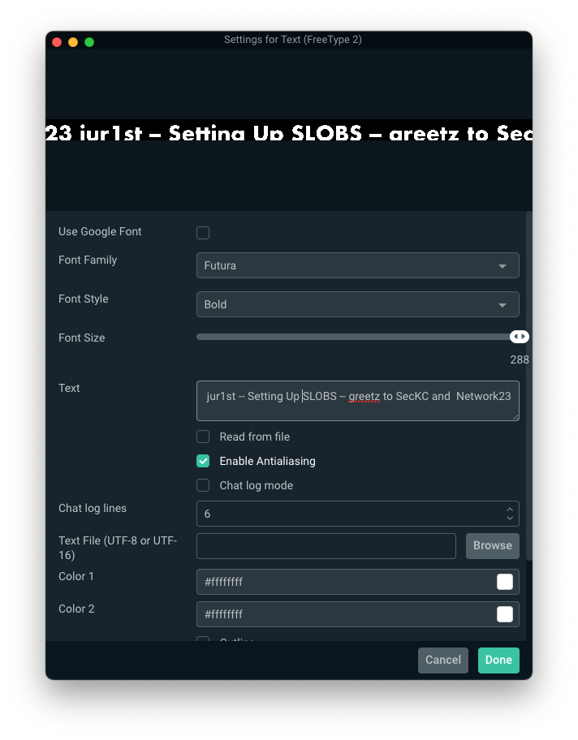

# DEFCON SLOBS Quickstart - MacOS

## Installation and Permissions

1. Download the template zip file from Basecamp to a known location (e.g. Downloads Folder); The zip file contains the template.overlay file and a version of Futura if you don't already have it as part of MacOS. 
2. Unzip the zip file you downloaded
3. Download & install Streamlabs OBS (SLOBS) for your platform: https://streamlabs.com/streamlabs-obs-live-streaming-software
4. If this is the first time running SLOBS you will have some setup to do:
      - Make sure to grant SLOBS permissions access camera and mic
      - You can skip the streaming service integrations
      - "Start Fresh"
      - You can tune the webcam/mic if you'd like, or revisit that later
      - Skip adding a theme (we will do this shortly).  

--- 
## Settings and Configuration
   
   *It's important that you apply the settings for output and video prior to importing the template set. If you've already added the template set and nothing fits on the canvas, delete the template set from SLOBS, apply these settings, then re-import the template set*.  
   
   Open the SLOBS application __Preferences/Settings__ to adjust some important settings:    
	  __Output__ ==> __Recording__: ensure the following selections:   
         - __Recording Quality__: *Indistingquishable Quality, Large File Size*.  
         - __Recording Format__: *mp4*.  
         - __Recording Path__: a path of your choice.  

 __Video__: from the left hand side of the preferences pane
            - Make sure both your __Base Canvas__ and __Output Resolution__ are set to `1920x1080`

---
## Import the DC29 Template Set

- Select the __Scene Collections__ preferences
- Select __Import Overlay File__
- Locate and select the __DC29-Slobs-Final.overlay__ file
- Click __Done__ to exit and save the changes
Verify you have new _Scenes_ in the __Scenes__ pane in the bottom left, select the appropriate scene for the video you will be recording. If successful, everything should look like this: 

---

## Customize for Your Talk

*Verify that your system already has the Futura font installed, otherwise it can be found in the template zip file and should be installed before continuing*    

You will need to edit the overlay text to describe your specific talk in **each** scene you will use
    
### Editing and Validating the Text & Font
   
- Double click the __Speaker/Talk Info__ in the __Sources__ pane 
- Check that the Font Family is set to __Futura__
- The Font Style should be set to __Heavy__
- The Font Size should be set to __288__

