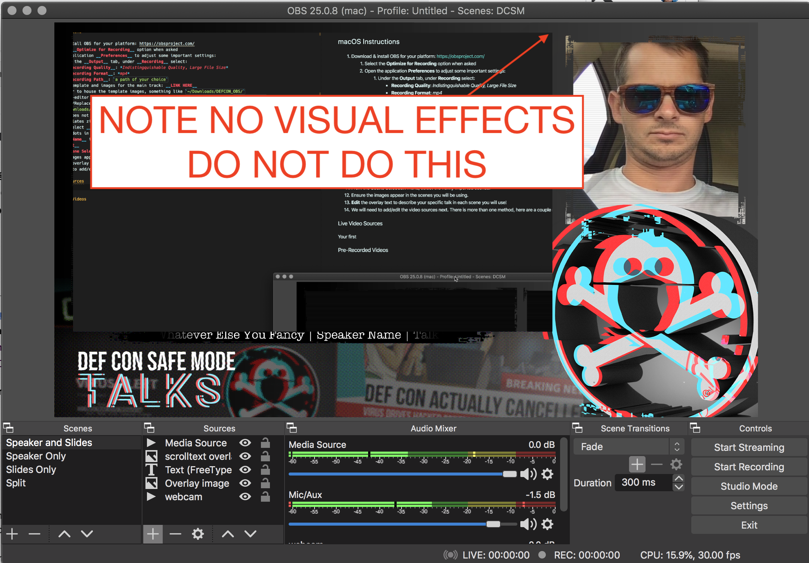

# DEFCON OBS Quickstart

## macOS Instructions

1. Download & install OBS for your platform: https://obsproject.com/
   1. Open OBS.app - if the first run, it should prompt you to run the optimization wizard
   2. Select the __Optimize for Recording__ option when asked
   3. Open the application __Preferences/Settings__ to adjust some important settings:
         1. Under the __Output__ tab, under __Recording__ select:
            - __Recording Quality__: *Indistingquishable Quality, Large File Size*
            - __Recording Format__: *mp4*
            - __Recording Path__: `a path of your choice`
        1. Go to the __Video__ tab on the left hand side
            - Make sure both your __Base Canvas__ and __Output Resolution__ are set to `1920x1080`
        2. Click __OK__ to exit and save the changes

### Get & Configure The Template
OBS does not support relative paths, operating-system-specific path specifiers (e.g. ~ or %USERPROFILE%) so we need to fix these paths in the template.

1. Download the template and images for the main track: __ZIP File Available on Fileserver__
2. Create a folder to house the template images, something like `~/Downloads/DEFCON_OBS/`
3. Open your text-editor of choice, if you don't have one, you can use the built-in `TextEdit.app`
4. Unzip the templates zip file you downloaded to the directory you specified above.
5. Using the Find/Replace feature of your text editor, open the *dc-safemode-main-talks.json* file you just unzipped, find `%PATH_VAR%` and replace with your desired path e.g `/Users/username/Downloads/DEFCON_OBS` - this should fix all your file paths and ready you for importing the scenes.
   - __NOTE:__ OBS does not recognize the tilde character e.g. `~/Documents/`
6. Open OBS and select __Import__ from the __Scene Selection__ menu.
7. Click the the dots in the collection path to specify the JSON file inside the directory you specified earlier.
8.  Change the __Name__ if you'd like to something you will recognize like `DEFCON-SAFEMODE` (it is set to DC28SMTalks by the template)
9.  Click __Import__
10. From the __Scene Selection__ menu, select the newly imported scenes.
11. Ensure the images appear in the scenes you will be using.
12. __Edit__ the overlay text to describe your specific talk in each scene you will use! 
    -  There are two text overlay items for different platforms, edit the one for your platform
        
    -  On each one of the Scenes you intend to use, click the eye icon next to the __Windows__ text item to hide it. (It probably won't appear anyway, but on some configurations, might appear as garbled text.)
    - The format is:  __Speaker Name | Talk Title | Whatever Else You Fancy |__ 
         - Note the pipes "|" in between.
13.  We will need to add/edit the video sources next. 

### Audio Sources
High quality audio is imperative to having your video meet quality standards. Here are some suggestions for the best audio:
- Stand about 2-3 inches from the mic to avoid distorting your voice
- Avoid background noise like air conditioning (no AC on is preferred)
- Avoid filming outside or in noisy areas
- Test that your sound does not have echo. If it does, try a smaller room or more insulated space (closets work well)
- Your average recording volume should be between -12dB and -10dB. Check your levels on OBS by looking at the audio mixer panel
- High quality microphones help, using something like a laptop's built in mic can pick up a lot of fan noise
- Use a foam covering or pop filter on your microphone if possible
- If you need to normalize your audio, please do:
   Normalization is an audio editing process that helps all of our videos stay on the same relative volume. Normalizing the audio ensures when someone streams your talk the audio will be at the same level as the other talks. There are many ways to normalize audio, here is one method using Audacity, which is a free, open source, cross-platform audio software.
   1. Export the audio track from your video and open it with Audacity
   2. Select “Effect” then “Normalize…”
   3. Only have the second box selected and set the maximum amplitude to “-.1DB”
   4. Export the edited audio and re-add it to OBS as an audio source or re-attach to your video
      - Try to minimize the number of compression cycles the audio goes through or use the maximum quality available so the audio isn't degraded in this process.
   

### Live Video Sources
You will need to add a video source (or two) to each of the scenes you plan to use. Your first video source will probably be of you speaking. Most presenters will probably be using a webcam or a phone, but there are many high resolution camera options available that work with OBS if you choose. Use something that shows you clearly. Lighting is more important than you think; you should be well-lit and use a background that contrasts your clothing so you appear clearly in the video.

Your second video source will likely be a screen recording or the screen of your computer for slides and or demos which you will record live. 

Regardless of which video source you choose, live or recorded, adding them will follow roughly the same instructions.
1. Select the scene you wish to use.
2. Under the sources pane, click the __+__ sign to add a source.
   - For capturing the screen, you would select __Display Capture__
   - For capturing a single window, you would select __Window Capture__ (this didn't always have expected results, testing is recommended)
   - For capturing a webcam, you would select __Video Capture Device__
3. Resize each video source to the correct size to fit within the template 
    - The existing template items should already be locked in position. Once your video sources have been placed in the correct location you can use the lock function on those items to prevent them from being accidentally moved as well
4. Check to ensure your video sources are listed at the bottom of the sources pane. This ensures they are "under" the template overlay and will inherit the same effects as other presenters
    
    
    

5. Resize and recenter your video after making sure it is under the template, it should appear to have horizontal stripes through the video and the edges of the video should look "torn" (see example)

### Test Recording

Once you have your video sources configured the way you want, they appear clearly in the preview window, and the audio level meter responds to your voice, you can try a test recording.

1. Click the __Start Recording__ option. 
    - You'll see a couple of visual cues, but in general, OBS does not have a lot of feedback during recording.
2. Record some test content. 
3. Click __Stop Recording.__

OBS places the recordings in the location you specified during the setup wizard, so you'll have to browse to that location and watch the video you just made. By default, they are named with the time and date you started recording. You'll want to peruse your test video to see how the audio sounds and how the video quality looks - if it all looks OK, you are good to record your full presentation.

### Pre-Recorded Video Sources
You may consider doing a screen recording of the slides/demos which you can then narrate with audio and video afterwards, if you run into errors, you don't have to re-record quite so much. Or, if the audio isn't as clear as you'd hoped upon review, you don't have to re-record the slides, just the speaker video. In this instance rather than using a live video source, you can set the source to be a media file. 
    
